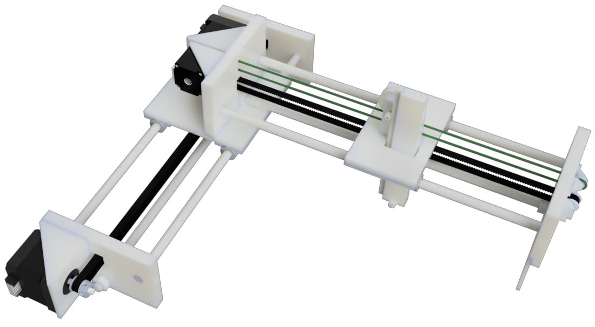

# 3 Axis Platform

A cheap 3-axis motion platform driven by stepper motors and a STM32F103C8T6 micro-controller.

## Design

The X and Y axis are driven by NEMA17 stepper motors and timing belts. The z axis is driven by a NEMA11 stepper motor connected to a pulley-belt then a pinion-rack system, reducing the weight of the Y axis platform and lowering magnetic interference at the end-effector.

